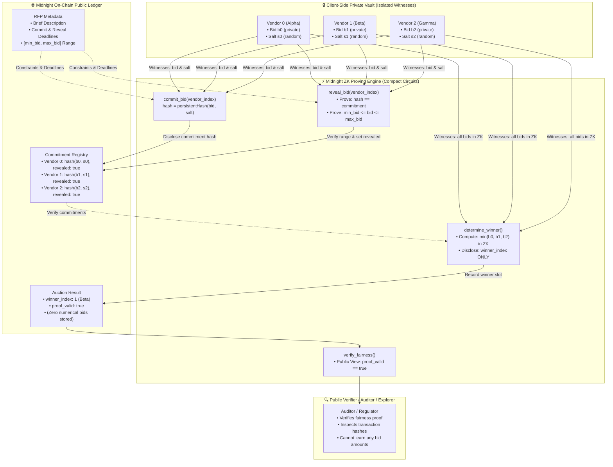
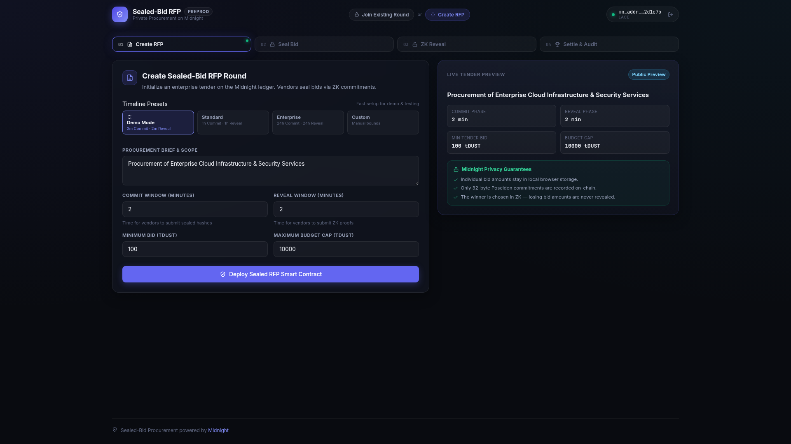
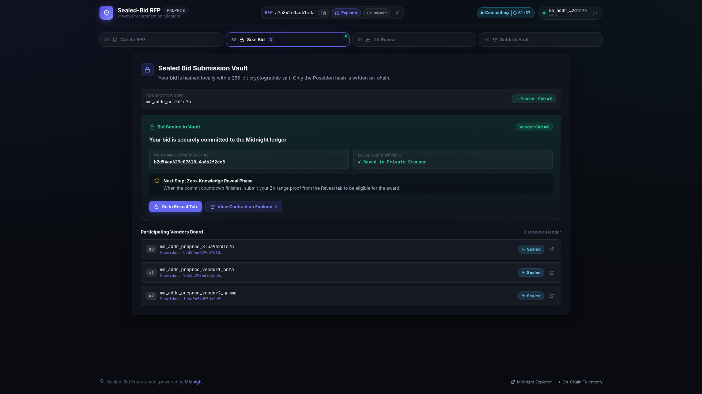
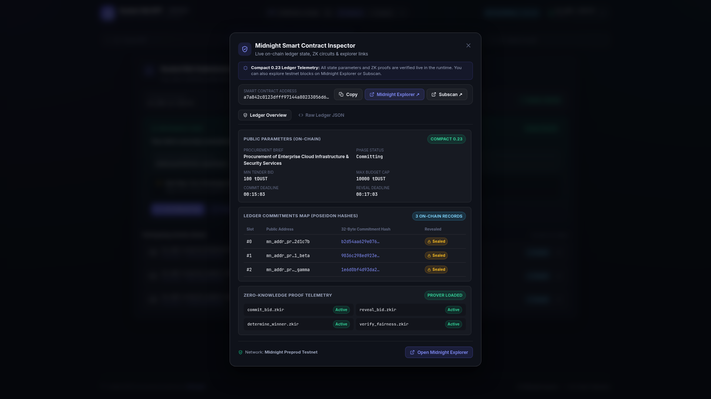
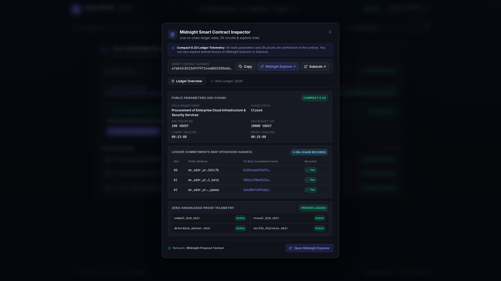
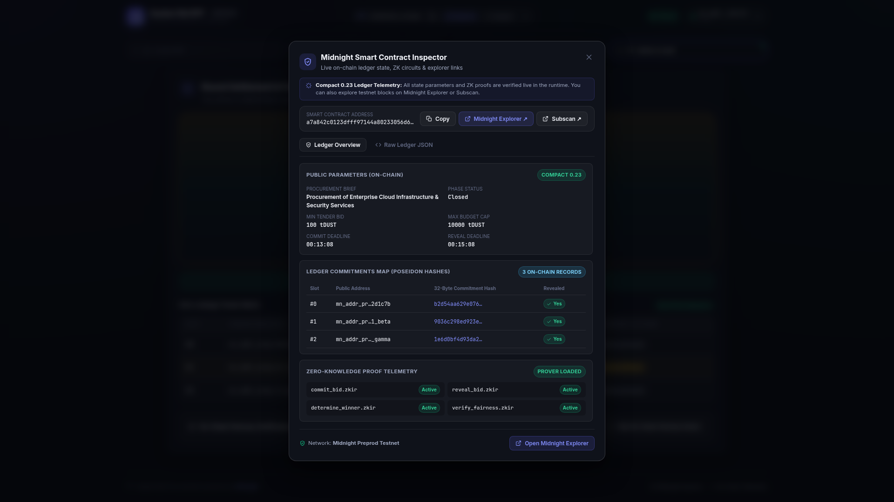
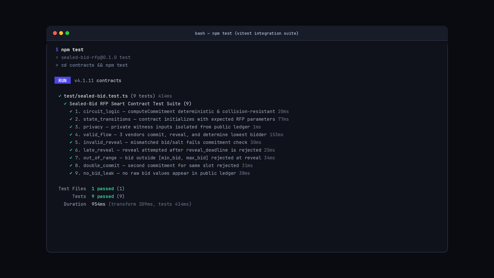

# Sealed-Bid Procurement / RFP System

[](https://github.com/Gamferno/sealed-bid-rfp/actions/workflows/ci.yml)
[](https://sealed-bid-rfp-ui.vercel.app/)
[](https://drive.google.com/file/d/1UsOcwqE3YmjjjkV7un3-yYFtLukGW5ga/view?usp=sharing)

> A privacy-preserving procurement platform where vendors submit cryptographically sealed bids on an RFP, the lowest bid wins on-chain, and every losing bid stays permanently private — while anyone can mathematically verify the winner was chosen fairly. Built on the [Midnight Network](https://midnight.network).

---

## 🔗 Live Demo & Video Walkthrough

- 🌐 **Live DApp Demo**: [https://sealed-bid-rfp.vercel.app](https://sealed-bid-rfp.vercel.app)
- 🎥 **Video Demo**: [Google Drive Video Link](https://drive.google.com/file/d/1UsOcwqE3YmjjjkV7un3-yYFtLukGW5ga/view?usp=sharing)

---

## What This Does

1. **Buyer** posts an RFP: description, allowed bid range, and phase deadlines (commit and reveal).
2. **Vendors** each select a private bid `b` and generate a cryptographic random salt `s`. They compute `commitment = persistentHash(b, s)` and submit the commitment hash on-chain. The actual numerical bid never leaves their machine.
3. After the commit deadline, vendors reveal: the ZK circuit proves `persistentHash(b, s) == commitment` and `min_bid <= b <= max_bid` without disclosing `b` in any public output or transaction logs.
4. Once reveals complete, `determine_winner()` is called. The ZK circuit computes the lowest bid across all participants in zero knowledge and emits **only** the winning vendor's slot index.
5. Anyone can call `verify_fairness()` to confirm the winner was chosen strictly according to the lowest bid rule.

---

## Privacy Model

### What an observer CAN learn:
- That an RFP exists, its public procurement brief, and deadline constraints.
- Which vendor slots participated (their commitment hashes).
- Who won (winning vendor slot index).
- That the winner's bid was **cryptographically proven** to be the lowest.
- That no reveal was accepted after the deadline, and no double-commitment occurred.

### What an observer CANNOT learn:
- The winning bid amount.
- Any losing bid amount.
- Any vendor's bid relative to another (beyond who won).
- The secret salt values used for commitment hashing.

---

## System Architecture



---

## 📸 Screenshots

### 1. Create RFP Round
Buyers initialize enterprise procurement rounds with custom budget bounds and deadline phases:


### 2. Client-Side Sealed Bids
Vendors submit cryptographic commitment hashes computed locally with random 256-bit salts:


### 3. On-Chain Ledger Inspector
Live telemetry demonstrating zero plaintext bid leakage—only hashes and proof flags exist on-chain:


### 4. Zero-Knowledge Reveal Prover
Proves bid range validity and commitment authenticity in ZK without exposing prices to competitors:


### 5. Round Settlement & Winner Declaration
Zero-knowledge minimum evaluation discloses only the winner's index and records a cryptographic audit trail:


### 6. Integration Test Suite
9 comprehensive automated integration tests passing in Vitest:


---

## Tech Stack

| Layer | Technology |
|---|---|
| **Smart Contract** | Compact 0.23, Midnight Network |
| **ZK Proof System** | Built into Midnight runtime (Binius / Plonk proof engine) |
| **Frontend** | React 19 + TypeScript + Vite |
| **Wallet Connector** | 1AM or Lace (Midnight DApp Connector API) |
| **Testing** | Vitest (9 automated integration tests) |
| **CI/CD** | GitHub Actions |

---

## Prerequisites

- Node.js ≥ 22
- [Midnight Compact compiler](https://docs.midnight.network/develop/tutorial/building/step1) (`compact`)
- [Lace wallet](https://www.lace.io/) or [1AM wallet](https://chromewebstore.google.com/detail/1am/bphnkdkcnfhompoegfpgnkidcjfbojjp) connected to Midnight Preprod

---

## Setup & Run Locally

```bash
# Clone
git clone https://github.com/Gamferno/sealed-bid-rfp.git
cd sealed-bid-rfp

# Install dependencies
npm install

# Compile the Compact contract (optional if using pre-compiled artifacts)
npm run compile

# Build contracts and UI
npm run build

# Start frontend dev server
npm --prefix ui run dev
```

---

## Run Tests

```bash
npm test
```

The test suite runs 9 automated tests verifying:
1. Deterministic and collision-resistant commitment hashing
2. Contract state transitions & initialization
3. Witness isolation from public ledger
4. End-to-end flow: 3 vendors commit → reveal → lowest bidder wins → fairness verified
5. Rejection of invalid reveal with tampered bid/salt
6. Rejection of late reveals after reveal deadline
7. Rejection of out-of-range bids
8. Prevention of double-commitments
9. Total absence of raw bid leakage in public ledger structures

---

## Product Proposal

See [PROPOSAL.md](./PROPOSAL.md) for the complete product brief, selective disclosure architecture, data model, and Mainnet feasibility assessment.
